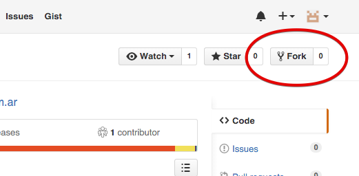
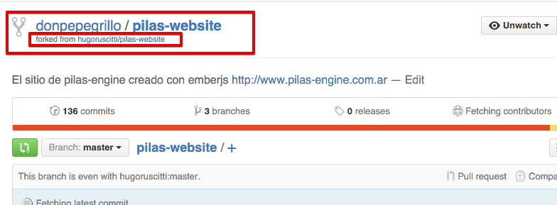
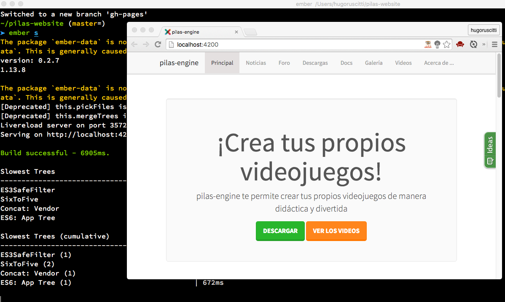

# pilas-website

[](https://travis-ci.org/hugoruscitti/pilas-website)

El sitio web del proyecto http://www.pilas-engine.com.ar realizado
con emberjs, liquid-fire y buena suerte :)


## ¿Cómo funciona la web?

El sitio web de pilas está desarrollado usando el framework
[emberjs](http://emberjs.com/) y la plataforma de publicación
[gitpages](https://pages.github.com/).

Emberjs nos permite hacer todo lo relacionado al contenido de la
web: separar el contenido en rutas, crear componentes para agrupar
información, recolectar datos de estadística, publicar versiones nuevas
fácilmente etc...

Mientras que gitpages nos sirve para alojar todo el contenido generado y
permitirle a todo el mundo acceder mediante un dominio.

Internamente, este repositorio tiene dos ramas. La rama "master" es la
que utilizamos para cargar contenido, y la rama "gh-pages" que cargamos
mediante un script automatizado. La rama "gh-pages" es la que gitpages
"servirá" si accedés a la web con el dominio www.pilas-engine.com.ar

## Quiero colaborar, ¿Cómo puedo hacer?

La recomendación inicial es visitar el [foro de pilas-engine](http://foro.pilas-engine.com.ar) y conversar con el equipo
de pilas, hay varias consejos, ideas y planes que no resumimos en este documento, pero que estaría buenisimo que lo puedas charlar con los chicos en el foro.


## Cómo realizar cambios y producir contenido en el sitio

El contenido del sitio está alojado en este repositorio, así que el primer paso para colaborar es utilizar la plataforma github+git.

Para realizar cambios se suelen seguir 3 pasos, al igual que con otros repositorio de código en github:

- 1 realizar un fork.
- 2 hacer cambios locales y commits.
- 3 realizar un pullrequest.


### Realizar un fork

Una vez que tengas el usuario de github, el primer paso es realizar un
fork de este repositorio y configurar tu entorno para comenzar a hacer
cambios.

Con tu usuario hacé un fork del proyecto:



y luego quedará una copia del repositorio en tu perfil de usuario:



el siguiente paso es clonar el repositorio e instalar todas
las dependencias:

```
git clone ruta_al_repositorio
sudo npm install -g ember-cli
cd pilas-website
make iniciar
```

Una vez instaladas todas las dependencias, se puede poner a funcionar
la web en forma local. Ember incluye un comando llamado 'serve' que inicializa
un servidor web, y recompila la aplicación con cada modificación.

Ejecutá el siguiente comando:

```
ember s
```

Y luego abrí un navegador en la dirección `http://localhost:4200`



Todos los archivos a editar están en el directorio ``app``, en particular
los que están en ``app/templates``. Observá que mientras el comando ``serve``
está corriendo, cualquier cambio que hagas en los archivos del directorio
``app`` tendrían que verse reflejados en el navegador sin necesidad de
actualizar el navegador.


